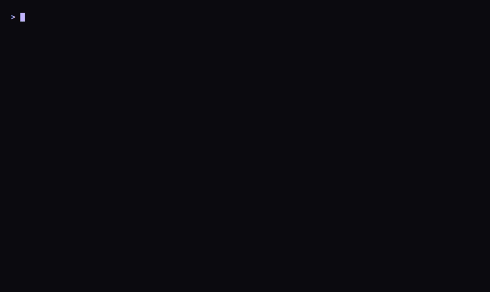
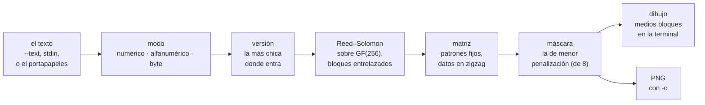

# clip2qr

<p>
  <a href="https://github.com/agustinyarrus/clip2qr/releases/latest"></a>
  
  
  
  <a href="LICENSE"></a>
</p>

Lo que copiaste, en un código QR en la terminal. clip2qr toma el portapapeles (o un texto) y lo dibuja con medios bloques, cuadrado y centrado, para que lo escanees con la cámara del teléfono directo de la pantalla: una URL, una clave de Wi-Fi, una dirección, sin mandarte un mensaje a vos mismo.

<p align="center">
  <picture>
    <source media="(prefers-reduced-motion: reduce)" srcset="demo/demo.png">
    
  </picture>
</p>
<p align="center"><sub>Una sesión real en una terminal de 100×30, grabada con <a href="https://github.com/charmbracelet/vhs">VHS</a>; el QR del GIF se lee con el teléfono (y con zxing-cpp) · <a href="demo/demo.webm">en video</a> · <a href="demo/demo.tape">el guion</a> · <a href="demo/LEEME.md">cómo regrabarla</a></sub></p>

<details>
<summary>¿Sin imágenes? La misma sesión, en texto</summary>

```text
> clip2qr --text "https://github.com/agustinyarrus/clip2qr"

  clip2qr  ·  convierte el portapapeles en un QR                                            v1.0.0


                                 █████████████████████████████████
                                 ██ ▄▄▄▄▄ ██▀██ █▄▀ ▀▀▄ █ ▄▄▄▄▄ ██
                                 ██ █   █ █ █▀▄ ▀█▄█▀██ █ █   █ ██
                                 ██ █▄▄▄█ █ ▄▄ ▀▀▄▀▄██▄ █ █▄▄▄█ ██
                                 ██▄▄▄▄▄▄▄█ █▄█ █▄▀ █ ▀ █▄▄▄▄▄▄▄██
                                 ██ ▀▄   ▄███▄▀▀▄ █▀ ▀▀▀█   ▄▄█▀██
                                 ██▄▀ ▀ ▀▄ ▄  ▄██▀▄▄█▄█▄███▄▀█▀███
                                 ██▀▄   ▄▄▀▄▀   ▄ ▄▀ ▀▀▀▀▀▀▀▄▄█▀██
                                 ███ ▀▄ ▄▄██  █ ▄█▄ ▄▀▀  ▀▀ ▄▄▀███
                                 ██ ██ █ ▄  ▄ █ ▀███ █ █ ▀ ▀▄ █▀██
                                 ██ █▄▄▀ ▄▀██ ▄▀ ▄▄▄█▄█ ▀ ▄▄█▄▀███
                                 ██▄█▄█▄▄▄█  ▄▄ █▄▄ ▄▀▄ ▄▄▄ ▀   ██
                                 ██ ▄▄▄▄▄ █▀ ▄ ██▀  █▄  █▄█ ▄▄▀███
                                 ██ █   █ █ ▄  █▀▀▄ ▄█▀ ▄▄▄▄▀   ██
                                 ██ █▄▄▄█ █▄▀▀▀ █ ▄█▄ ▄  ▄ ▄ ▄ ███
                                 ██▄▄▄▄▄▄▄█▄▄█▄██▄▄▄▄█▄██▄▄▄█▄████
                                 ▀▀▀▀▀▀▀▀▀▀▀▀▀▀▀▀▀▀▀▀▀▀▀▀▀▀▀▀▀▀▀▀▀


     clip2qr

     ● Contenido    https://github.com/agustinyarrus/clip2qr
     ● Longitud     40 caracteres
     ● Fuente       argumento --text
     ● Versión QR   3 (29×29)
     ● Corrección   nivel M
```

</details>

Un único `.exe` de unos 2 MB, en Go puro y con un codificador QR propio: sin instalador, sin dependencias, sin nube; el texto no sale de la máquina. Antes vivía en navaja, una suite de herramientas de consola para Windows; ahora es un proyecto propio.

[Por qué](#por-qué) · [Instalar](#instalar) · [Uso](#uso) · [Recorrido](#recorrido) · [Cómo funciona](#cómo-funciona) · [Cómo se verificó](#cómo-se-verificó) · [Límites](#límites)

## Por qué

Pasar una URL de la PC al teléfono suele terminar en un mensaje a uno mismo, en un chat o en un mail: el texto viaja a un servidor para recorrer un metro. Un QR en la pantalla lo resuelve sin red, y en la terminal no hace falta abrir nada: `clip2qr` y la cámara.

Dibujarlo bien tiene su técnica:

- **Cuadrado y legible.** Un carácter de consola es el doble de alto que de ancho. Con medios bloques (`▀ ▄ █`), cada carácter lleva dos módulos apilados: el código sale cuadrado y ocupa la mitad de renglones.
- **Al revés en una consola oscura.** Los lectores esperan tinta oscura sobre papel claro. En una terminal de fondo negro, clip2qr pinta el módulo *claro* y deja el oscuro del color del fondo; `-i` es para las de fondo claro.
- **Un QR que solo lee su propio codificador no sirve.** Un error en el orden del polinomio de Reed–Solomon da un código que se ve perfecto y ningún teléfono lee (le pasó a clip2qr al principio). Por eso cada código se contrasta con zxing-cpp, un decodificador independiente, en la PNG y en el dibujo de la terminal.

## Instalar

Bajá `clip2qr.exe` de la [última release](https://github.com/agustinyarrus/clip2qr/releases/latest) y copialo a una carpeta del `PATH`. Es el programa entero: Windows 10 u 11 de 64 bits (se probó en Windows 11), sin instalador. Al lado viene `SHA256SUMS` para comprobarlo:

```powershell
(Get-FileHash .\clip2qr.exe -Algorithm SHA256).Hash -eq ((Get-Content .\SHA256SUMS) -split '\s+')[0]   # True
```

El `.exe` es reproducible: la misma etiqueta compilada con el mismo Go da los mismos bytes en cualquier máquina ([cómo](docs/RELEASE.md#5-el-exe-es-reproducible)).

Con [Go](https://go.dev/dl) 1.26 o más nuevo (con un Go 1.21+ más viejo, Go baja solo la versión que pide el `go.mod`):

```powershell
go install github.com/agustinyarrus/clip2qr@latest
```

Desde el repo:

```powershell
.\build.ps1          # dist\clip2qr.exe, con la versión, el commit y el SHA256
.\build.ps1 -Test    # antes, go vet y todas las pruebas
```

No tiene módulos externos: el codificador, la PNG y el portapapeles son biblioteca estándar de Go y código propio.

## Uso

```powershell
clip2qr                                  # QR de lo que haya en el portapapeles
clip2qr "https://ejemplo.com/pagina"     # de un texto puntual (o con --text)
Get-Content nota.txt | clip2qr -         # de la entrada estándar (o con --stdin)
clip2qr -e h -o wifi.png                 # corrección alta y, además, guardado como PNG
clip2qr -i                               # para terminales de fondo claro
```

| Flag | Qué hace |
|---|---|
| `--text TEXTO` | usar este texto en vez del portapapeles |
| `--stdin`, `-` | leer el texto de la entrada estándar |
| `-e`, `--level l\|m\|q\|h` | la corrección de errores: más alta, más robusto y más denso (m) |
| `-q`, `--quiet N` | módulos de borde claro alrededor (2); la PNG lleva al menos 4 |
| `-i`, `--invert` | invertir claro y oscuro, para terminales de fondo claro |
| `-o`, `--png ARCHIVO` | además, guardar el QR como PNG |
| `-s`, `--scale N` | píxeles por módulo en la PNG (8) |

Flags al estilo GNU (`-e h`, `--level=h`, `--`); un flag mal escrito sugiere el más parecido. Respeta `NO_COLOR` y `--no-color`; si la salida no es una consola, no emite ni un escape (y el dibujo sigue siendo el mismo, en texto). Códigos de salida: `0` todo bien · `2` línea de comandos inválida · `3` no se pudo (el portapapeles no tiene texto, o el texto no entra ni en la versión 40).

<details>
<summary><code>clip2qr --help</code>, entera</summary>

```text
> clip2qr --help

  clip2qr  ·  convierte el portapapeles en un QR en la terminal                             v1.0.0

  uso
    clip2qr                  QR de lo que haya en el portapapeles
    clip2qr "texto o URL"    QR de un texto puntual
    echo hola | clip2qr -    QR de la entrada estándar

  contenido
        --text TEXTO      usar este texto en vez del portapapeles
        --stdin           leer el texto de la entrada estándar

  código
    -e, --level l|m|q|h   corrección de errores (más alto = más robusto y más denso) (m)
    -q, --quiet N         módulos de borde claro alrededor (2)
    -i, --invert          invertir claro/oscuro (para terminales de fondo claro)

  guardar
    -o, --png ARCHIVO     además, guardar el QR como PNG
    -s, --scale N         píxeles por módulo en el PNG (8)

  general
    -h, --help            muestra esta ayuda
    -V, --version         muestra la versión
        --no-color        salida sin colores (también respeta NO_COLOR)

  ejemplos
    clip2qr                      el caso típico: copiás una URL y la escaneás con el teléfono
    clip2qr -e h -o wifi.png     QR robusto y guardado como imagen
    clip2qr --text "https://…"   sin tocar el portapapeles

  notas
    · Todo local: el texto no sale de la máquina.
    · El QR se dibuja con medios bloques para que quede cuadrado; si tu terminal no los muestra
      bien, guardá el PNG.
```

</details>

## Recorrido

Todas las salidas de esta sección son reales: clip2qr 1.0.0 en una consola de 100 columnas, capturadas el 28/9/2026. En la consola, el código va pintado sobre el fondo oscuro; acá, según la fuente del navegador, pueden verse líneas finas entre renglones que en la terminal no están.

### Una red de Wi-Fi, robusta y en PNG

El formato `WIFI:S:<red>;T:WPA;P:<clave>;;` es el que entienden las cámaras de Android y de iPhone para conectarse sin tipear la clave. Con `-e h` el código aguanta que se tape hasta un 30 % (en una pantalla con reflejos, ayuda), y con `-o` queda también como imagen, con el borde de 4 módulos que pide la norma. La PNG de esta corrida, de 360×360, la lee zxing-cpp con el texto exacto.

```text
> clip2qr --text "WIFI:S:MiRed;T:WPA;P:clave-secreta-123;;" -e h -o wifi.png

  clip2qr  ·  convierte el portapapeles en un QR                                            v1.0.0


                             █████████████████████████████████████████
                             ██ ▄▄▄▄▄ █    ▄██ ▄▀██▀ ▀▀██ ▀▀█ ▄▄▄▄▄ ██
                             ██ █   █ █▄▀ ▄██▄▄█▄▀ ▄▀▄ ▄▀  ██ █   █ ██
                             ██ █▄▄▄█ █▀▀ █ ▀ ▄█▄▀▀▀▄ ▀█ ▀ ▄█ █▄▄▄█ ██
                             ██▄▄▄▄▄▄▄█ █ █▄█▄▀ ▀▄█ ▀ ▀▄▀▄█▄█▄▄▄▄▄▄▄██
                             ████  ▄█▄▀▄▄ ▀▄▀ ▄██▀▄█▀▀▀ ▀▄▀█ ▄▄█▀▄▄▄██
                             ██ ▄▄██▀▄▀▀▄ ▀▀ ▀██ ▄ █▀█▀▄█ ▄▄▀▀█▄▀█ ▄██
                             ██▄ ▄▀ █▄▀█ ▀▀██▄ ▄▄ █▄▀▀██ ▄█▀▀▄▀▄▄▄█▄██
                             ██ ▄ ▄▄▀▄▀▄ ▀▀▀▄ ▄▄▀ ▄▄ ███▄▀▄▄██▀▄█▄  ██
                             ██ █▀ ▄▀▄▄▄▀▀  ███ ▄▀█ █▀ ▀█  ▀  ▄▄▄█  ██
                             ██ ▀ ▄ ▀▄███▀  █▄▄▄▄▀▀█▄ ▀ ▄▀ █  ▀█ █▄ ██
                             ██▄▀▄▀▄▄▄ █▄██▄▀██▄█  ▀█▀▀ ▄ ▄▄█▄▀██ ████
                             ██▄█▀ ▄▀▄▄█▄▀▀▄▄▀ ▄█       █▀▄▄▀▄▀▄▄█▄ ██
                             ██  █▀ ▀▄▀▄▄▄▀▀ ▀▀███ ▄█ ▄▀▀▀▄▄▀▄▄▄▄ ▄▄██
                             ██ █▄█▄ ▄█   ▀ ▄█ █▀█▀█▀ █▀█▀▄▄██▄█▀█▄▄██
                             ██▄█▄█▄▄▄█▀ ▄▀▄▀▀▀██ █▀▄▀▀██ █ ▄▄▄ ▀ ████
                             ██ ▄▄▄▄▄ ████▀▀█▄▀▀ ▀ ████████ █▄█ ██▄▄██
                             ██ █   █ █ ▀▄▀ ▄▀█▄ ▀▀▄  █▄▄▀▄▄     ▀█▄██
                             ██ █▄▄▄█ █▄▄▀█▀███▀▀█▄▀ █ ▄▄██▄   ██▄█ ██
                             ██▄▄▄▄▄▄▄██▄██▄▄▄██▄▄▄██▄▄▄▄▄██▄█████▄▄██
                             ▀▀▀▀▀▀▀▀▀▀▀▀▀▀▀▀▀▀▀▀▀▀▀▀▀▀▀▀▀▀▀▀▀▀▀▀▀▀▀▀▀


     clip2qr

     ● Contenido    WIFI:S:MiRed;T:WPA;P:clave-secreta-123;;
     ● Longitud     40 caracteres
     ● Fuente       argumento --text
     ● Versión QR   5 (37×37)
     ● Corrección   nivel H
     ● PNG          wifi.png
```

### Lo que no entra

La versión 40, la más grande, tiene 177×177 módulos. Lo que no entra ni ahí es un error con los números, no un código roto:

```text
> clip2qr --text ('a' * 3000)

  ✗ el texto es demasiado largo para un código QR (3000 caracteres, nivel M)
```

### Un flag mal escrito

```text
> clip2qr --text hola --levle h

  ✗ no conozco --levle; ¿quisiste decir --level?
  › clip2qr --help muestra todas las opciones
```

## Cómo funciona



### De dónde sale el texto

En este orden: `--text`, la entrada estándar (`--stdin` o `-`), los argumentos sueltos unidos por espacios y, si no hay nada de eso, el portapapeles. El portapapeles se lee por la API de Windows en `CF_UNICODETEXT` (UTF-16) y se pasa a UTF-8; abrirlo se reintenta unos instantes, porque otro programa puede tenerlo tomado, y la memoria se copia a un búfer de Go con un tope de 16 millones de caracteres. Un texto vacío o solo con espacios es un error, no un QR vacío.

### Los datos

- **El modo más compacto** que cubre el texto entero: numérico (3 dígitos en 10 bits), alfanumérico (2 caracteres de un juego de 45 en 11 bits) o byte (UTF-8 tal cual). Las minúsculas no están en el juego alfanumérico: una URL en minúsculas va en modo byte.
- **La versión más chica** en la que entran el indicador de modo, la cuenta de caracteres (cuyo largo depende del modo y de la franja de versiones, 1–9, 10–26 y 27–40) y los datos, con el nivel pedido.
- **El relleno** del estándar: terminador, alineación al byte y los bytes `0xEC 0x11` alternados hasta la capacidad.
- **Las tablas**, lo menos posible a mano: codewords totales por versión, corrección por bloque y cantidad de bloques. El reparto en dos grupos de bloques se deriva con la regla de la norma en vez de tabular las 160 combinaciones.

### La corrección de errores

- **GF(256)** con el polinomio `x⁸+x⁴+x³+x²+1` (`0x11d`) y tablas de exponenciales y logaritmos: multiplicar son dos búsquedas.
- **Reed–Solomon**: el polinomio generador de cada grado se calcula una vez, con el coeficiente líder primero. Ese orden fue el bug que al principio hacía ilegible cualquier código; `TestReedSolomonVector` fija los bytes de un vector conocido para que no vuelva.
- **Entrelazado**: los codewords se toman columna por columna entre los bloques. Una mancha o un reflejo daña bytes de varios bloques, y cada uno lo corrige por su cuenta.

### La matriz y la máscara

- Los patrones fijos: los tres buscadores con sus separadores, los de alineación (desde la versión 2), las líneas de sincronización y el módulo oscuro. El formato (nivel y máscara) va con BCH(15,5) en sus dos copias, y la versión, con BCH(18,6) desde la 7.
- Los datos, en zigzag de a dos columnas, subiendo y bajando, esquivando la columna 6 y lo reservado.
- **La máscara**: se prueban las 8 y se queda la de menor penalización según las cuatro reglas de la norma (tiradas de 5 o más módulos iguales, bloques de 2×2, patrones que se parecen a un buscador y el desbalance entre claros y oscuros). Cuesta O(8·n²), con n el lado.

### El dibujo

- **En la terminal**, dos filas de módulos por renglón: `▀` (arriba), `▄` (abajo), `█` (los dos) o un espacio, con el borde de `--quiet` (2 por defecto, para ahorrar lugar) y centrado en el ancho de la ventana. Por defecto invertido, para consolas oscuras.
- **En PNG**, `--scale` píxeles por módulo y al menos 4 módulos de borde, el mínimo de la norma, escrito de forma atómica (temporal y renombre: un corte no deja una imagen a medias).

Más detalle: [docs/ARQUITECTURA.md](docs/ARQUITECTURA.md).

## Cómo se verificó

La regla: clip2qr no se contrasta consigo misma. [zxing-cpp](https://github.com/zxing-cpp/zxing-cpp), un decodificador independiente y muy usado, lee lo que clip2qr escribe.

| Qué | Contra qué | Resultado |
|---|---|---|
| el codificador | [`gen.go`](internal/qr/_oracle/gen.go) emite 72 PNG (15 textos por 4 niveles: dígitos, alfanumérico, español con tildes y ñ, hebreo con japonés, Wi-Fi, vCard; y los 12 textos más largos que entran en la versión 40, uno por modo y nivel) y [`decode.py`](internal/qr/_oracle/decode.py) los lee con zxing-cpp | 72 de 72, de la versión 1 a la 40 |
| el dibujo de la terminal | [`terminal_all.ps1`](internal/qr/_oracle/terminal_all.ps1): 5 textos (de "hola" a 300 letras), cada uno normal, invertido y con nivel H; [`terminal_check.py`](internal/qr/_oracle/terminal_check.py) reconstruye la matriz desde los medios bloques que imprime el `.exe` y la decodifica | 15 de 15, y el control con otro texto esperado falla, como tiene que ser |
| la demo | el último cuadro del GIF de este README, con zxing-cpp | la URL exacta |

- **58 pruebas de Go** (`go test ./...`), entre ellas el vector de Reed–Solomon y los límites de capacidad de la versión 40 de la norma (ISO/IEC 18004, tabla 7), por modo y nivel: el texto más largo que entra da versión 40 y uno más da error.
- **CI en `windows-latest`** con el Go mínimo del `go.mod` ([`ci.yml`](.github/workflows/ci.yml)): formato, `go vet` (también para Linux), todas las pruebas, el `.exe` con su versión y su SHA256, y los dos oráculos de zxing-cpp sobre ese `.exe`.

El detalle, con la lección del polinomio al revés: [docs/VERIFICACION.md](docs/VERIFICACION.md).

## Límites

- **Leer el portapapeles no tiene prueba automática.** Ni las pruebas ni los oráculos tocan el portapapeles de quien los corre (sería pisarle lo que tiene copiado): pasan el texto con `--text`.
- **Un solo modo por código.** Una URL con un número largo al final va entera en modo byte; partirla en segmentos de distinto modo daría un código una o dos versiones más chico.
- **Sin ECI**: el modo byte no declara que el texto es UTF-8, y los lectores lo adivinan (zxing-cpp acierta en todos los casos del oráculo, hebreo y japonés incluidos).
- Se compila y se prueba para `windows/amd64`. El codificador compila en cualquier sistema (la CI corre `go vet` para Linux), pero clip2qr lee el portapapeles de Windows.

Lo que falta, en orden: [docs/PENDIENTE.md](docs/PENDIENTE.md).

## Estructura

```
main.go               abre la consola y llama a clip2qr.Main
internal/
  clip2qr/            la herramienta: de dónde sale el texto, el dibujo centrado, la PNG y la tarjeta
  qr/                 el codificador: modos, tablas, GF(256), Reed–Solomon, BCH, máscaras, dibujo
    _oracle/          gen.go, decode.py, terminal_check.py y terminal_all.ps1, contra zxing-cpp
  win/desk/           el portapapeles y el modo de la consola, por syscall
  fsx/                escritura atómica de la PNG
  cli/                flags estilo GNU, ayuda, "¿quisiste decir…?"
  tui/                consola: paleta, tarjetas, formato es-AR
  textdist/           distancia de Damerau–Levenshtein
  version/            versión y commit, estampados por build.ps1
demo/                 la grabación del README y su guion de VHS
docs/                 arquitectura, verificación, pendientes y cómo se arma una release
.github/              la CI: formato, vet, pruebas, oráculos y el .exe con su SHA256
build.ps1             compila dist\clip2qr.exe con la versión y el commit (-Test: antes, vet y pruebas)
```

## Licencia

[MIT](LICENSE).
